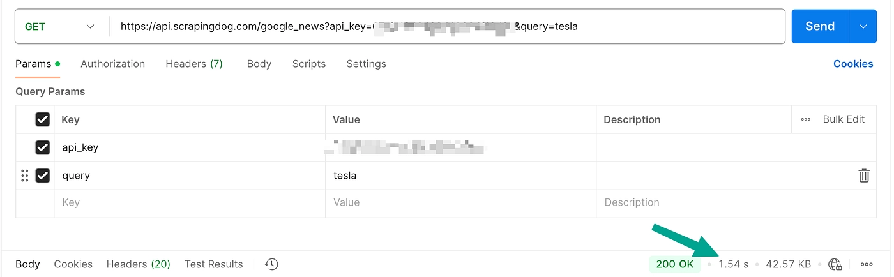

# 5 Best Google News API Alternatives for Real-Time Data in 2025

Google doesn't provide an official News API anymore, but if you're building news aggregators, market intelligence tools, or content monitoring systems, you'll need reliable alternatives. Whether you're tracking breaking stories, analyzing sentiment, or building competitive intelligence dashboards, picking the right news data API can save you time and money.

This guide breaks down five solid options for scraping Google News data, with real performance tests and honest pricing comparisons so you can choose what actually works for your use case.

---

## Why You Need a Google News API Alternative

Before diving into the options, let's talk about what matters. You're probably looking for an API that delivers fresh news data without getting blocked, handles large-scale requests without falling apart, and won't drain your budget. The APIs below were tested on response time, data quality, and cost efficiency.

## 1. Scrapingdog's Google News API

Scrapingdog built their news scraping API to be fast and straightforward. No complicated setup, no random failures—just consistent news data when you need it.

**Response Time:** Around 2 seconds in Postman tests. That's pretty solid for a web scraping API handling anti-bot measures in the background.

**What Works:**
- You get 1,000 free credits to test things out before committing
- Historical data support via the 'tbs' parameter (useful if you're analyzing trends)
- Scales up with concurrency on bigger plans
- Live chat support that actually responds

**Pricing:** 400,000 requests for $40. If you're doing the math, that's a fraction of what competitors charge. The free tier is generous enough to prototype your project and see if it fits.

Check the [documentation](https://docs.scrapingdog.com/google-news-api) for implementation details, or sign up for free credits to kick the tires.

## 2. SerpAPI

SerpAPI has been around for a while and delivers consistent uptime with Google News scraping. Their response time hovers around 2.01 seconds—comparable to Scrapingdog.

**Performance:** Stable and reliable. If uptime matters more than cost, SerpAPI won't let you down.

**The Catch:** Pricing. Their developer plan costs $75 for just 5,000 requests. Compare that to Scrapingdog's 400,000 requests for $40, and you're paying roughly 120x more per request. Unless you're running a small-scale operation or need their specific features, this might hurt your budget.

If you're evaluating SERP scraping APIs more broadly, 👉 [we compared the top Google search scraper APIs here](https://www.scraperapi.com/?fp_ref=coupons), looking at scalability, response speed, and real-world performance metrics.

## 3. Newsdata.io

Newsdata.io focuses exclusively on news data and has been in the game for years. They support historical news archives, which is handy if you're doing deeper trend analysis or building datasets for machine learning projects.

**Performance:** Response times were decent in testing, nothing extraordinary but reliable enough for most use cases.

**Pricing:** Starts at $199.99 per month. That's steep if you're just scraping fresh news headlines. Better suited for established businesses with larger budgets or projects requiring historical archives.

## 4. ScraperAPI

ScraperAPI offers structured data endpoints, including one for Google News. On paper, it sounds good. In practice? The free tier testing showed mixed results.

**Performance Issues:** Average response times hovered above 7 seconds, with some requests spiking to 23 seconds. That's rough if you need real-time or near-real-time data.

To be fair, this was tested on the free tier, so performance might improve on paid plans. Still, when other APIs consistently deliver sub-3-second responses, this lag is noticeable.

**Pricing:** $49 for the basic plan gets you 100,000 credits, with each news request costing 25 credits (so 4,000 news API calls). Not terrible, but the response time inconsistency is a concern.

## 5. HasData News API

HasData rounds out the list with a dedicated Google News API. It's less known but worth mentioning for specific use cases.

**Response Time:** Around 3.3 seconds average in Postman. Not the fastest, but acceptable depending on your needs.

**Pricing:** 200,000 credits for $49, with news endpoint requests costing 5 credits each (40,000 requests total). Competitive pricing if response speed isn't your top priority.

---

## Which Google News API Should You Choose?

Here's the deal: if you're watching your budget and need reliable speed, Scrapingdog delivers the best balance. Their response times are consistently fast, pricing is transparent, and the free tier lets you test without risk. For projects requiring rock-solid uptime and you've got budget flexibility, SerpAPI is a strong choice despite the premium cost.

If you need historical news data and have enterprise-level budgets, Newsdata.io specializes in that. ScraperAPI and HasData are worth considering if their specific features align with your needs, but watch those response times.

The right choice depends on your project's scale, budget, and performance requirements. 👉 [Test ScraperAPI's free tier](https://www.scraperapi.com/?fp_ref=coupons) to see how it handles your specific news scraping needs before committing to a paid plan.

---

**Want more scraping resources?** Check out our guides on the best LinkedIn scrapers and top Google search scraper APIs to round out your data collection toolkit.
